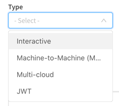

# Switching from ADFS to AzureAD for AzureAD Groups in QCS

## Introduction

If you're a Qlik Enterprise SaaS early adopter, you managed to configure Azure
Active Directory as the identity provider for your tenant using the ADFS option
in the settings menu. While this enabled users to authenticate from Azure AD, it
didn't solve a key problem with this work around; native Azure group name
resolution.

The new Azure AD identity provider settings in QCS include proper group name
resolution. But you might be hesitant to switch the configuration from ADFS
because you're worried about the impact on existing access control set up in
your tenant. Will Space permissions work after the switch? Will users retain all
their personal content? Will the switch create duplicate users? This blog
resolves these concerns by showing you how to make the switch from ADFS to Azure
AD smoothly.

## Good news: The app registration in Azure AD remains valid

There's no need to reinvent the wheel and create a new app registration in Azure
to support the switch. However, there is a significant tweak to make if you want
to take advantage of Qlik's capabilities to resolve group names from Azure. Here
are the steps to prepare the existing app registration for reuse in QCS.

### Create a new client secret

In all likelihood, you misplaced - or should have lost - the client secret you
created when you set up the app registration the first time. It's easy enough to
generate a new secret for the app in the certificates and secrets section of the
config. Create a new client secret and make a copy of it for
use when you update QCS.

### Remove groups optional claim from Token configuration

Say what now? Remove the groups claim? Yes, that's right, you don't need the
groups claim anymore to obtain a user's groups because the Azure AD setting in
QCS contacts the Microsoft Graph API to collect this information, resolving the
group names for Azure AD native groups and groups synchronized through
AD-Connect.

### Add GroupMember.Read.All API permissions

The reason the optional groups claim is not needed is there is an API permission
allowing sharing the groups the user is a member of. When the permission
`GroupMember.Read.All` is added to the app registration, Qlik makes a request to
the MS Graph on behalf of the user to obtain the group names for which they are
a member.

> Before you continue! Make sure to grant admin consent for the new
> GroupMember.Read.All permission. If you miss this step, expect http 401 errors
> because of the request to Microsoft Graph.

## Create a new interactive identity provider configuration in QCS

While Qlik Enterprise SaaS allows for only one active interactive identity
provider in a tenant, you can set up more to make it easier to switch from one
to another.

For converting from an ADFS configuration to an Azure AD setup it's
straightforward but there are a couple of tweaks you want to pay attention to
ensuring a smooth transition. Here are the steps:

### Copy IdP settings from the existing ADFS configuration

Take some screenshots of the ADFS set up, and record the discovery URL and
Client ID to notepad so you can reuse them in the new configuration.

### Create the Azure AD configuraiton

Create a new interactive identity provider selecting Azure AD from the provider
list.

Add the discovery URL for the app registration and input the Client ID and the
new client secret created earlier in the corresponding text boxes.

Fill out the claims mapping values from your ADFS settings screenshot.

Lastly, to make sure the mapping works properly expand Advanced options and
slide the email verified override switch to on.

Create the configuration and save it.

After you authenticate to the new identity provider, the validation screen
appears. With the new email verified claim switch turned on, the email shows up
signifying the mapping process succeeded. Click through and activate the IdP.

> Log out completely. This may require you to log out twice, once as the new
> validated user, and once as the user you logged in as to create the new
> configuration.

Log in through Azure and go to a space to add members and view friendly group names.

