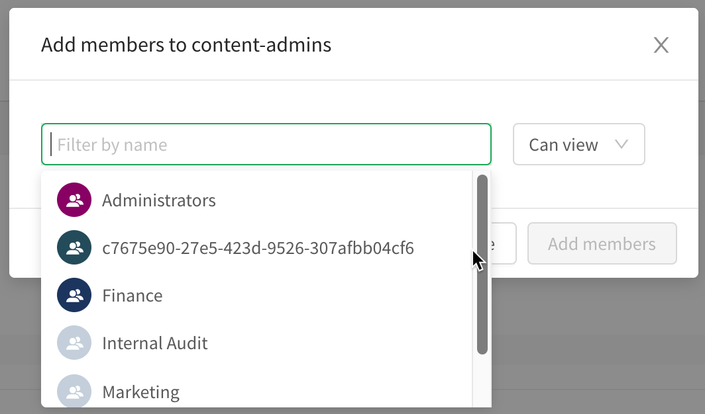
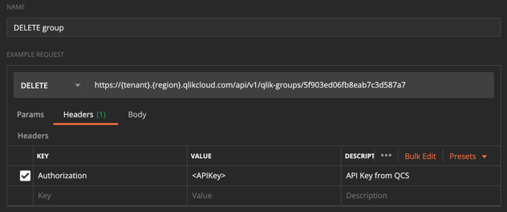
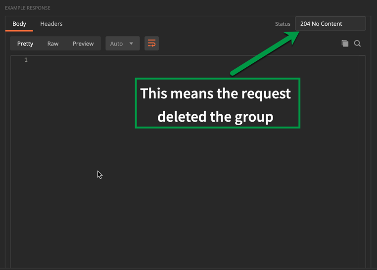
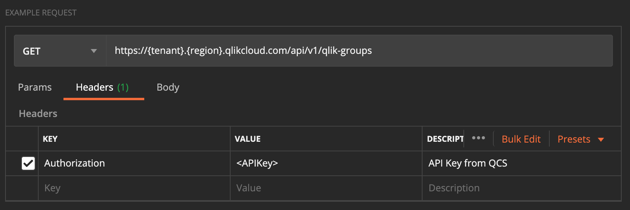
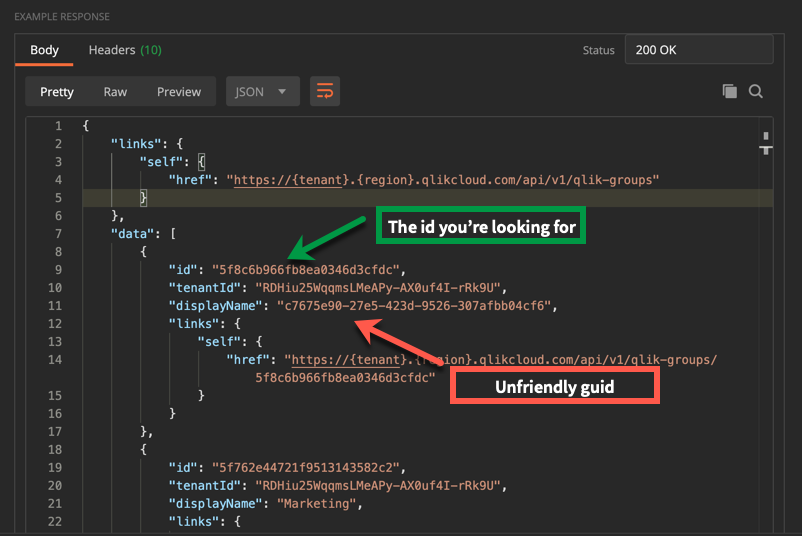

# Deleting guid group values from Qlik Cloud Services

> ## **Warning**
> Executing the steps in this blog constitutes acknowledgement and
> understanding of the following:
> 1. The Groups API is a private API in Qlik Cloud Services.
> 2. Private APIs are subject to change or deprecation at any time without
>    notice.
> 3. There is no guarantee of support for private APIs from Qlik support.
> 4. Choosing to use Qlik private APIs is at your own risk.

## Introduction

So you just updated your Qlik Enterprise SaaS tenant to use Azure AD from ADFS.
You're psyched because groups and their names... well they look like friendly
names you can read.

But, and there's always a but,  you still have groups that look like this:



In this blog, I'm going to show you how you can remove these unwanted groups
from your Qlik Cloud Services tenant using Postman or qlik-cli.

## Requirements

To delete groups from a Qlik Cloud Services tenant you need the following:

* [An account with a professional license allocation](https://help.qlik.com/en-US/cloud-services/Subsystems/Hub/Content/Sense_Hub/Admin/mc-assigning-access-to-users.htm#anchor-4)
* [The same account needs Tenant Admin and Developer roles assigned](https://help.qlik.com/en-US/cloud-services/Subsystems/Hub/Content/Sense_Hub/Admin/mc-adminster-tenant-admins.htm)
* [API-keys enabled in the tenant settings](https://qlik.dev/tutorials/generate-your-first-api-key)
* Knowledge of REST APIs, and [Postman](https://www.postman.com/) or [qlik-cli](https://qlik.dev/libraries-and-tools/qlik-cli)

Please click on the links above to learn how to configure a tenant for this
exercise.

## The more you know

Deleting groups from a tenant does not prevent them from reappearing because
group claim import takes place each time an end-user authenticates. The intent
of this procedure is to remove groups that will no longer exist in the
end-user's group claim. 

> ## **Explanation**
> Switching to the new Azure AD setting changes the way group claim
> value resolution occurs during authentication. Instead of reading the optional
> groups claim, Qlik contacts Microsoft Graph to obtain the friendly name
> for groups and import the values returned. Therefore, it's possible to remove
> the guids and not have them reappear in a tenant.

## Delete a group using Postman

Deleting a group using Postman with the groups API is straightforward. In the
request menu, set the method type to `DELETE` and enter the URL for the groups
endpoint adding the `id` attribute value for the group to be deleted to the
path like in this screenshot. 



Here is a copy/paste URL you can build from:

```
https://{tenant-hostname}.{region}.qlikcloud.com/api/v1/qlik-groups/{group-id}
```

You have to include an API Key in the Authorization header for the request to
succeed. Once this information is added to the request window press the Send
button. If the response comes back with an `http/204` code then the group has
been removed from the groups database.



> **Note**
>End-users may continue to see the group in the list until they log out and log
>in again to Qlik Cloud Services because the list of groups in the ui does not
>update in real-time.

## Finding Group IDs

Identifying the guid group you want to delete in the QCS hub is easy because it
manifests itself in the list. However, the identity of the group on the backend
is an id and this value is necessary for deleting unwanted groups as the
previous example describes.

The groups API has a GET method for obtaining a list of groups. From the result,
you can obtain the id of the group to delete and use it in the DELETE method.



The root resource for qlik-groups will return a list of groups. Make sure to
include your API key in the Authorization header of the GET request.

The result is a JSON array of groups. The example below displays the id of the
offending guid group.



## Delete a group using qlik-cli

The context for deleting a group using qlik-cli is no different than Postman.
Therefore, here are some sample scripts you can use to delete a group using
qlik-cli.

```bash
#!/bin/bash

## Deleting a group from Qlik Cloud Services using qlik-cli

## First get a list of groups from the tenant
groups=$(qlik raw get v1/qlik-groups)

## Response (shortened for brevity)
{
  "links": {
    "self": {
      "href": "https://{tenant}.{region}.qlikcloud.com/api/v1/qlik-groups"
    },
    "next": {
      "href": "https://{tenant}.{region}.qlikcloud.com/api/v1/qlik-groups?startingAfter=5ee523963ade64539faf158b"
    }
  },
  "data": [
    {
      "id": "5ee523963ade643421af1589",
      "tenantId": "TohbNbUjAGrVXhrvVujU73hzgDQ6DxnG",
      "displayName": "c7675e90-27e5-423d-9526-307afbb04cf6",
      "links": {
        "self": {
          "href": "https://{tenant}.{region}.qlikcloud.com/api/v1/qlik-groups/5ee523963ade643421af1589"
        }
      }
    },
    {
      "id": "5ee523963ade64539faf158b",
      "tenantId": "TohbNbUjAGrVXhrvVujU73hzgDQ6DxnG",
      "displayName": "a39785e6-a097-4663-b885-80409b5d7a06",
      "links": {
        "self": {
          "href": "https://{tenant}.{region}.qlikcloud.com/api/v1/qlik-groups/5ee523963ade64539faf158b"
        }
      }
    }
  ]
}

## If you know the group displayName you can filter on it using jq
group=$(qlik raw get v1/qlik-groups | jq -r '.data | .[] | select(.displayName == "c7675e90-27e5-423d-9526-307afbb04cf6")'

## Returns
{
  "id": "5ee523963ade643421af1589",
  "tenantId": "TohbNbUjAGrVXhrvVujU73hzgDQ6DxnG",
  "displayName": "c7675e90-27e5-423d-9526-307afbb04cf6",
  "links": {
    "self": {
      "href": "https://{tenant}.{region}.qlikcloud.com/api/v1/qlik-groups/5ee523963ade643421af1589"
    }
  }
}

## Simplify to return just the id to the variable using this command
group=$(qlik raw get v1/qlik-groups | jq -r '.data | .[] | select(.displayName == "c7675e90-27e5-423d-9526-307afbb04cf6") | .id')

echo $group
## Returns
5ee523963ade643421af1589

## Delete the group using qlik raw again with a delete command adding the id
deleteResponse=$(qlik raw delete v1/qlik-groups/$group --verbose)

## Response
DELETE https://jog2.us.qlikcloud.com/api/v1/qlik-groups/5ee523963ade643421af1589
> Authorization: Bearer **omitted**
> Referer: https://jog2.us.qlikcloud.com
> User-Agent: qlik/1.7.1 (darwin) raw
< Cache-Control: no-store
< Connection: keep-alive
< Date: Wed, 13 Jan 2021 21:12:11 GMT
< Pragma: no-cache
< Ratelimit-Limit: 5
< Ratelimit-Remaining: 5
< Server: nginx
< Strict-Transport-Security: max-age=15724800; includeSubDomains
Status: 204 No Content
Empty response body
Response time: 1365ms

## Verify group deleted
qlik raw get https://jog2.us.qlikcloud.com/api/v1/qlik-groups/5ee523963ade643421af1589

## Returns
Error: 404 Not Found

```

## Recap

This is the way to remove groups with guids for names that arrived from Azure
Active Directory if you set up the service as an identity provider in Qlik Cloud
Services before the Azure AD setting became available. The Postman method is the
easiest, but the cli method enables you to get a list of groups and look at the
display names to identity guids for names and process the deletion.