# OpenID Connect configuration in Qlik Cloud Services - Explained

OpenId Connect wants to be a simplified mechanism for modern web application
authentication. But like most identity management schemes in software there are
so many details to consider it can be hard
to understand all the I/O. In this blog, I'll give my best effort to explain
OpenId so you can speak about it intelligently, at least in context of
configuring it for use with Qlik Enterprise SaaS.

## Authenta-what-now?

_Photo by <a href="https://unsplash.com/@nathangbingle">Nathan Bingle</a> on <a href="https://unsplash.com/s/photos/kids-food">Unsplash</a>_

OpenID Connect has more words and acronyms to try to explain what it is than
letters in the word "authentication", including OAuth, JWT, claims, client, authorization server, and more, so it makes sense to begin with some basic
definitions.

## Basic Definitions

* OpenID Connect == aka OIDC, an authentication scheme for modern web applications
* OAuth 2.0 == an authorization framework and the foundation of OpenID Connect
* JWT == JSON web tokens contain the payload exchanged in an OAuth 2.0 handshake
* Token == a JWT
* Payload == Information in the form of claims to be exchanged
* Claims == the information describing the subject of the JWT
* Subject == aka "sub", a unique identifier, and claim, typically representing a user
* Resource Owner == the user accessing a third-party application through OpenID
Connect
* Authorization Server == an identity provider, or the resource server storing
information about the resource owner
* Third-party Application == the "client" application requesting information
about the resource owner from the authorization server
* Client == for the purposes of this blog, Qlik
* Scopes == permissions the authorization server grants the client, in many cases access to additional claims necessary to fulfill
  the client auth request

> _Check out the links at the end of the blog to learn more about OpenID,
> OAuth 2.0, and JWT_

This is not an exhaustive list of terms in the OIDC orbit, however, it's a
decent primer for what you need to know for integrating OpenID with Qlik.

## The Double-click

If all I gave you were the basic definitions, you may feel bamboozled by the
title of the blog. So here is some additional context for OpenID Connect and
OAuth 2.0 before I get into Qlik-specific details.

### OpenID Connect

OpenID Connect is an identity layer built on the OAuth 2.0 protocol. OIDC,
as it is commonly referred, verifies identities between third-party applications
like Qlik and an identity provider like Azure Active Directory, Okta, or Auth0.
OIDC exchanges information using JWTs (aka JSON web tokens.)

### OAuth 2.0

OAuth 2.0 is a framework for authorizing applications to share user profile information
between a resource owner (the user), the authorization server (the identity provider), and the third-party application
(aka the client, aka Qlik.) Exactly what information is shared depends upon the
"scopes" the authorization server grants the client application.

## Qlik and the Identity Provider

In Qlik SaaS, there are four different types of identity providers you can set
up in an instance. This blog is interested in only discussing the
**Interactive** option because it is the choice for connecting Qlik to an OIDC
provider.

Selecting Interactive populates the **Provider** drop-down list with a number of
popular vendors who offer OIDC capabilities. Depending on the provider you
select, common values in the **Claims mapping** and **Advanced settings** sections will
auto-populate in the text boxes. I'll discuss Claims mapping in more detail
below. For now, I'm going to move to the **Application credentials** section of
the configuration

### Application credentials

The Application credentials section of the configuration is where you enter in
the information that identifies Qlik as a registered application with the
identity provider. 

> This blog doesn't cover the manual configuration options. Check
> [help.qlik.com](https://help.qlik.com) for information related to Application
> credential manual
> configuration.

#### **Provider configuration URI**

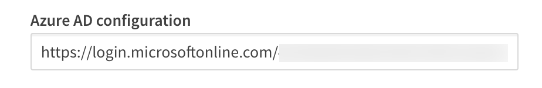

The configuration URI is a publicly accessible web address Qlik can navigate to
access the OIDC metadata for the identity provider. The metadata informs Qlik of
additional URIs to authenticate users and acquire JWTs containing supported
claims, among other data describing the authorization server. Typically, the
configuration URI will look like this:

`https://login.microsoftonline.com/<your-azuread-tenant-id>/v2.0/.well-known/openid-configuration`

#### **Client ID**

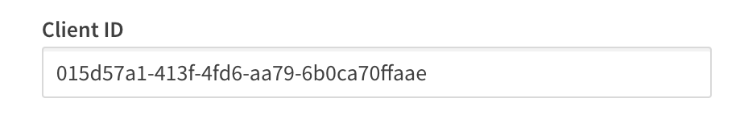

The Client ID is a public, unique string issued by the identity provider representing
the application registration; in this case Qlik is the registered application
with Microsoft Azure Active Directory. Qlik supplies the Client ID to Azure AD
during authentication requests to route the request properly. Without the Client
ID, Azure AD can't identify the app registration and responds with an error.

#### **Client secret**

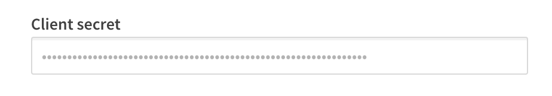

The Client secret is a private, unique string issued by the identity provider,
known only to the client and the authorization server. It is used in requests
made to the identity provider to acquire the JWT token containing the
authenticating user's profile information.

_Courtesy [xkcd](https://xkcd.com/)_

#### **Realm**

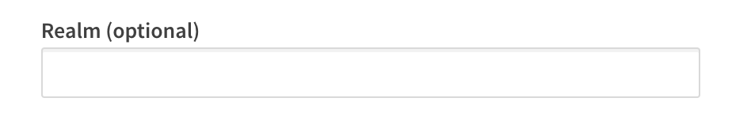

The Realm is an optional value intended to contain a pattern to determine the
validity of an OpenID authentication request. In Qlik, it is sometimes used to
specify a Windows domain which gets prefixed to the userid.

### Claims mapping

When a user authenticates successfully to Qlik, the authentication service
generates a new "internal" token using the claims from the identity provider
token. The claims are "mapped" to this new token based on the claim names in
each of the text boxes for the corresponding claim.

Certain claims, like the **sub**, **email**, and **email_verifed** are required
claims from the identity provider token. Others, like **groups** and **picture**
are optional claims. In Qlik
SaaS, all of the claims listed in the mapping section are configurable, meaning you can set it to any claim name you know
exists in the identity provider token.

#### **sub (Subject)**

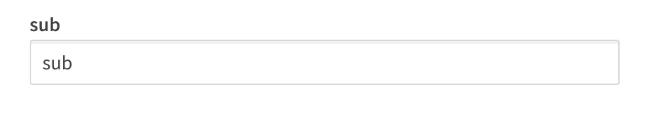

The sub is a unique identifier representing the End-User at the identity provider. 

The sub claim value must be unique for each End-User accessing Qlik SaaS because
the platform relies upon the sub claim to act as the unique UserId in
Qlik. 

The typical sub value looks like a random string of characters like
`AItOawmwtWwcT0k51BayewNvutrJUqsvl6qs7A4`. But as you can see, as a UserId the
sub isn't readable. If you are migrating from an on-premises Active Directory to
Azure AD, you may want to consider an alternate claim for the mapped sub.

> ### _A Short Detour to AD Land_
>
>  If you are used to `example\hardcoreharry` representing a UserId, then
>  chances are you have migrated from an on-premises Active Directory to Azure
>  AD. 
>
> The identifiable UserId in this pattern is known as the `sAMAccountName`.
> sAMAccountName is an available claim if your Azure AD synchronizes with an on-premises AD
> through AD-Connect. If you have Qlik Sense applications with Section Access
> script, consider changing the sub claim to map the sAMAccountName from the
> identity provider token.

#### **name**

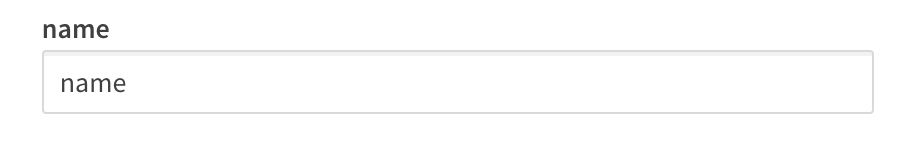

The name is a standard claim sent in OIDC JWTs. It represents the End-User's
full name. Qlik will use this mapped claim as the friendly name used in
greetings, user profile information, and in access control settings for
artifacts like spaces.

#### **groups**

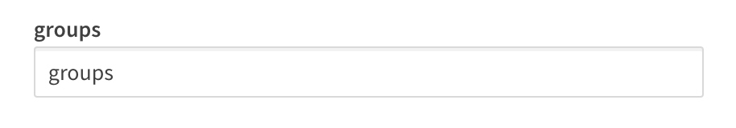

Groups is not a standard claim of OIDC. It is an optional claim that needs to be
configured to be sent by the identity provider. Its name gives away the values
the claim contains, but make sure you know the way the values appear. Certain
identity providers like Azure AD do not send friendly names for native groups
using an optional group claim, sending the unique identifier for the group
instead.

#### **email**

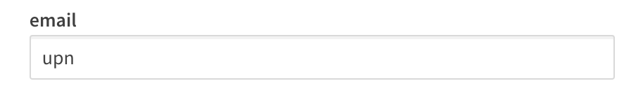

Email is a standard claim of OIDC, and is intended to represent the preferred
email address of the End-User. Some providers do not send the email address in
the email claim because their own services support the user having multiple
preferred email addresses. For example, in my Azure AD there is no value in the email claim
for my users, however, the `upn` contains the End-User email address because it is
the user principal name for that user.

#### **client_id**

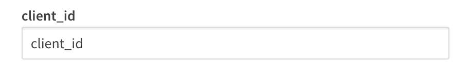

The client_id claim contains the same value you entered in the Application
credentials. It is required by OAuth 2.0 to be present in the payload of claims.

#### **picture**

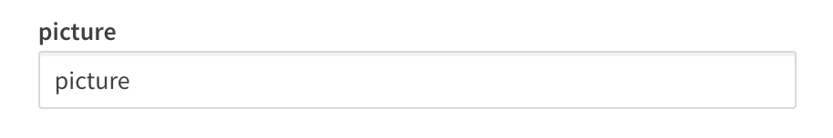

The picture claim contains a url for the End-User's profile picture. If you configure
the picture claim to map a different claim, the value must be a url and must
refer to an image file. If no picture claim is sent by the identity provider,
Qlik will not attempt a mapping.

#### **email_verified**

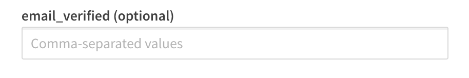

The email_verified claim contains a boolean value confirming the user has
verified their email with the identity provider. It is standard claim of OIDC, but it is not a
requirement to be sent by the identity provider. This can cause problems for
claims mapping with Qlik because Qlik **requires** the presence of an
email_verified claim set to true to perform the complete claims mapping process.

**_Each identity provider handles email_verified differently_**

* Okta and Auth0 send an email_verified claim because they require End-Users to
  verify their email address to access the service.

* Onelogin does not send an email_verified claim in the default payload. You
  will need to add a custom claim to your configuration to send the
  email_verified claim to Qlik, and identify the claim name
in this text box for Qlik to map it.

* Azure AD does not send an email_verified claim in their token because
  Azure B2B users do not have to verify their email and because the user may
  have the same email address for accounts in different AZure Active Directory
  instances, it's not possible to provide a single verification mechanism which
  all ADs can read from. I address handling Azure AD email_verified claim
  challenges in the Advanced options section.

### Advanced options

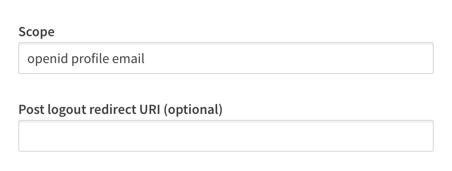

For the majority of providers, there are two advanced options you can adjust.
One is to specify the scopes the configuration should read from, and the other
is a text box to supply a url to be navigated to when a user logs out of Qlik
SaaS.

There is one special advanced option that appears if you are using Azure AD as a
provider, and that is a switch for the email_verified claim. I mentioned above
that Azure AD does not supply an email_verified claim in the token sent to Qlik.

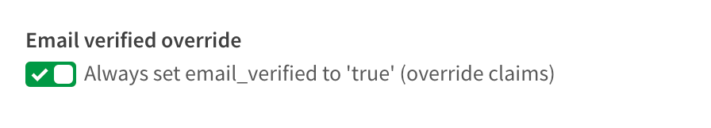

You could set up a custom claim in Azure AD that sends a boolean value to Qlik.
I've done it, and it's a pain. So I asked the R&D team to copy what our friends
at Auth0 do and provide the switch. Once the switch is set to true, Azure AD
claims map to Qlik without any issue.

## Recap

So there you have it, clear as mud right? Hopefully you come away from
reading this with a better understanding of the inputs for an OpenID
Connect configuration with Qlik Enterprise SaaS. While filling in these inputs
is straightforward, it's unfortunate that every provider
out there implements OIDC differently. Along with reference links for OIDC and
OAuth 2.0 below, check out the links related to configuring these different
providers with Qlik.

Happy Qlikking!

## References
OpenID core specification -
https://openid.net/specs/openid-connect-core-1_0.html

Auth0 OpenID Connect Protocol -
https://auth0.com/docs/protocols/openid-connect-protocol

OAuth 2.0 RFC - https://tools.ietf.org/html/rfc6749

OAuth 2 Simplified - https://aaronparecki.com/oauth-2-simplified/

JWT Introduction - https://jwt.io/introduction/

## Qlik Enterprise SaaS Identity Provider Configuration Guides
Azure AD -
https://community.qlik.com/t5/Qlik-Sense-Documents/How-To-Configure-Qlik-Sense-Enterprise-SaaS-to-use-Azure-AD-as/ta-p/1704442

Auth0 -
https://community.qlik.com/t5/Qlik-Sense-Documents/How-To-Configure-Qlik-Sense-Enterprise-SaaS-to-use-Auth0-as-an/ta-p/1724074

Okta - Coming soon!

Keycloak - Coming soon!
