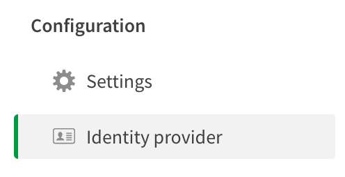

# Configure Qlik Cloud Services to use Onelogin as an IdP.

## TL;DR

* Create and configure OpenID Connect (OIDC) for Qlik Cloud Services in
  Onelogin
  
  * Configure groups claim settings
  * Add a custom user field for email_verified claim

* Configure Qlik Cloud Services identity provider settings to use Onelogin

## Requirements

* A paid account or developer account on Onelogin
(https://www.onelogin.com/developer-signup).
* A Qlik Cloud Services Enterprise tenant with "Bring your own IdP" enabled
* Tenant Admin role assigned in Qlik Cloud Services to complete configuration

## Instructions

### Create and configure OpenID Connect (OIDC) for Qlik Cloud Services in Onelogin

1. Begin the configuration by accessing your Onelogin tenant and click on
Administration in the menu bar.

2. Click on the Applications menu item that appears and select Applications.

3. The app list of entries in Onelogin appears. Click the Add App button.

4. Enter `OpenID` in the search box and choose the OpenId Connect (OIDC) option
   from the list to create this kind of app.

5. The initial configuration for the app appears. Enter a display name and add
   icons to represent the application to this screen. Then press Save.

Another screen appears under the Configuration banner for the application
details. 

   The tenant-assigned-hostname is a random generated value when you create a
   Qlik Cloud Services tenant.
   You can find the tenant hostname value and the fully-qualified domain name
   for your tenant in the Qlik Cloud Services management console in the Settings
   menu.

   >**WARNING** Using the tenant alias name in this configuration breaks the
   >connection between Onelogin and Qlik. In other words, using the tenant-alias
   >doesn't work, so use the tenant-assigned hostname.

6. Enter the hostname for the Qlik Cloud Services tenant's callback address in
   the Redirect URI's input box like this `https://<hostname>/login/callback`
   where `<hostname>` equals the value from the Settings menu in the management
   console.

7. Click on the Parameters menu item. In this screen, you are going to modify
   the format groups are passed from Onelogin to Qlik so Qlik processes them
   properly upon a successful user authentication.

8. Click on the Groups entry in the list.

9. Update the `Default if no value selected` to *User Roles* and in the
   drop-down below change it to *Semicolon Delimited input*. Press the Save
   button.

The updated parameter configuration appears like this:

10. Click the SSO menu item and record the *Client ID* *Client Secret* and the
    V2 *Issuer URL*. These values are needed by the Qlik configuration to
    connect Qlik to Onelogin.

11. Save the configuration.

12. Go to the top menu, select *Users* and click on *Custom User Fields*.

What you are going to do is add the email_verified claim as a custom attribute
to the users registered in your Onelogin instance. The email_verified claim is a
required claim by Qlik to validate the user is a valid user according to the
identity provider. If the user is not a valid user, Qlik rejects the
claims the identity provider is sending to Qlik, therefore, Qlik does not map
claims from the IdP to the user's Qlik session token. For more information about
email_verified configuration in Onelogin visit this page
(https://developers.onelogin.com/openid-connect/guides/email-verified).

13. Click the plus sign to create a new user field. Name the field
    email_verified and provide it with the same shortname. Save it.

14. Now go to Users menu from the top of the screen. Select one of the user's in
    your Onelogin tenant, preferably the account you are going to test the Qlik
    connection. 
    
    Scroll down the list of information describing the user until you find the
    Custom Fields section and the new email_verified input box. Add `true` as
    the value of this field and Save the user. If you choose to use Onelogin as
    an IdP for Qlik, the email_verified input needs to be updated for each user.
    This can be done manually as described above, or updated using an API
    referenced in this [article](https://developers.onelogin.com/openid-connect/guides/email-verified).

15. Go back to the app configuration for Qlik Cloud Services and select the
    Parameters menu.

16. Add a new field to the parameters list by clicking the Plus sign. Give the
    new field the name `email_verified`.

17. When you press save, the screen adds a drop-down menu to select the field to
    map to. Choose  the `email_verified` custom field you created earlier for
    the user profile. Save it.

18. Save the configuration one more time. This completes the Onelogin
    configuration steps.

### Configure Qlik Cloud Services identity provider settings to use Onelogin

1. Open the Qlik Cloud Services management console. Select the Identity provider menu item on the screen.

2. Click the Create new button to open the configuration menu.

3. Select *Interactive* for the type and *Generic* for the provider of this Idp.
   Enter *onelogin* into the description so you know what this configuration is.

4. In the Application credentials section, add the information recorded from the
   onelogin configuration screen. Start with the V2 OpenID Connect URI, and
   provide the Client Id and Client Secret you copied earlier in the
   corresponding input boxes.

5. In the Claims mapping section, if you are using the default Onelogin
   configuration there is nothing to change. However, you do need to add
   `email_verified` to the optional email_verified input box at the bottom of
   the mapping so that Qlik maps the value, subsequently mapping the users
   claims info to their session token.

6. In the Advanced options, add `openid profile email groups` just like this to
   the Scopes input box. The scopes tell Onelogin what to send back to Qlik in
   the identity token for the user.

7. Complete the configuration by pressing the Create button.

8. Save the configuration when the pre-emptive message appears. Clicking Save
   triggers the validation flow.

9. As part of the validation process, Qlik attempts to connect to Onelogin and
   performa an authentication. If the configuration is correct, the login screen
   appears. Enter the username for the account you are validating the the
   configuration.

10. Enter the password for the user and click Continue.

11. Upon successful validation, Qlik supplies a message and requests you confirm
    the information is valid.

12. The last steps include making the validation user a tenant admin
    (recommended) and choosing to activate the identity provider.

> Activating the identity provider will disable any currently active OpenID
> Connect identity provider configured in your Qlik Cloud Services tenant.

To begin using the new identity provider, log out of Qlik Cloud Services
completely. This includes any active user sessions in the hub or management
console for the tenant you just updated the configuration.